# DESPLIEGUE — Evidencias y respuestas

Este documento recopila todas las evidencias y respuestas de la practica.

---

## Parte 1 — Evidencias minimas

### Fase 1: Instalacion y configuracion

1) Servicio Nginx activo
- Que demuestra: Que el contenedor del servidor web Nginx está en ejecución y exponiendo el puerto 8080.
- Comando: `docker compose up -d` y `docker compose ps`
- Evidencia:

  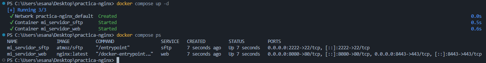

2) Configuracion cargada
- Que demuestra: Que Nginx está cargando el fichero de configuración del sitio (`default.conf`) desde `/etc/nginx/conf.d`.
- Comando: `docker exec -it mi_servidor_web ls -l /etc/nginx/conf.d`
- Evidencia: 

  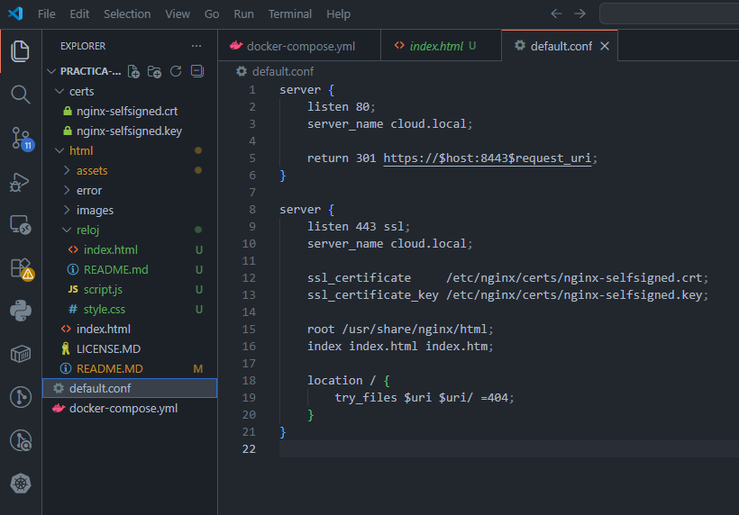

3) Resolucion de nombres
- Que demuestra: Que el nombre `cloud.local` resuelve a la máquina local y se usa para acceder al sitio en lugar de la IP.
- Evidencia: 

  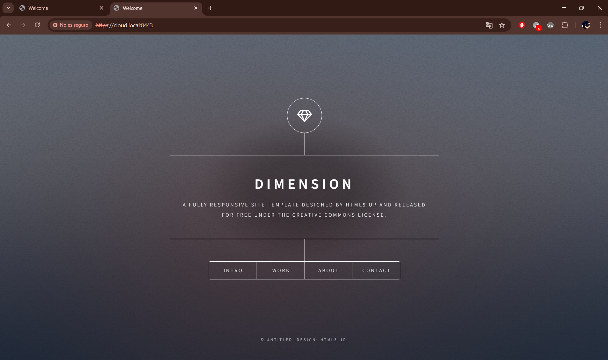

4) Contenido Web
- Que demuestra: Que la página estática de CloudAcademy se está sirviendo correctamente desde el contenedor Nginx.
- Evidencia: 
  
  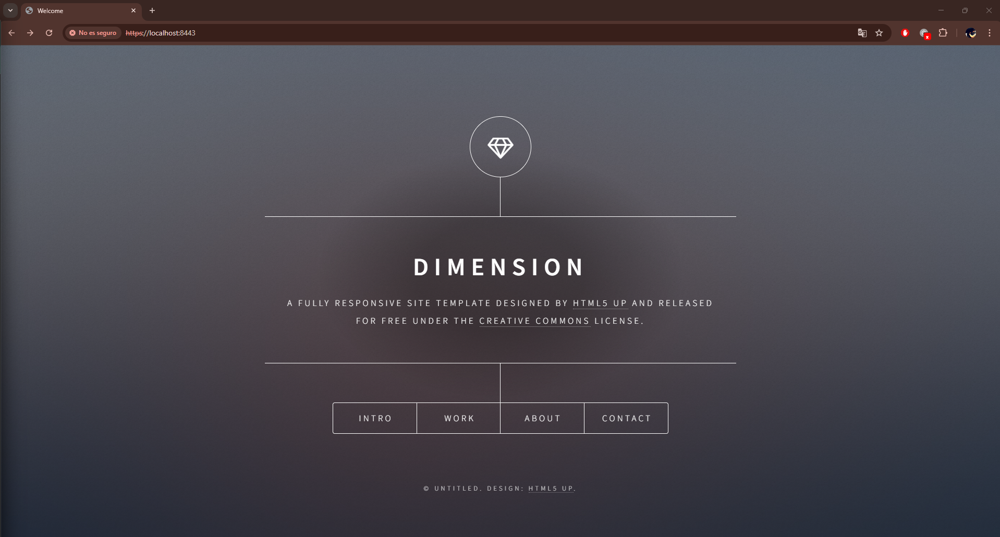

---

### Fase 2: Transferencia SFTP (Filezilla)

5) Conexion SFTP exitosa
- Que demuestra: Que el servicio SFTP acepta conexiones en `localhost:2222` con el usuario configurado.
- Evidencia: 

  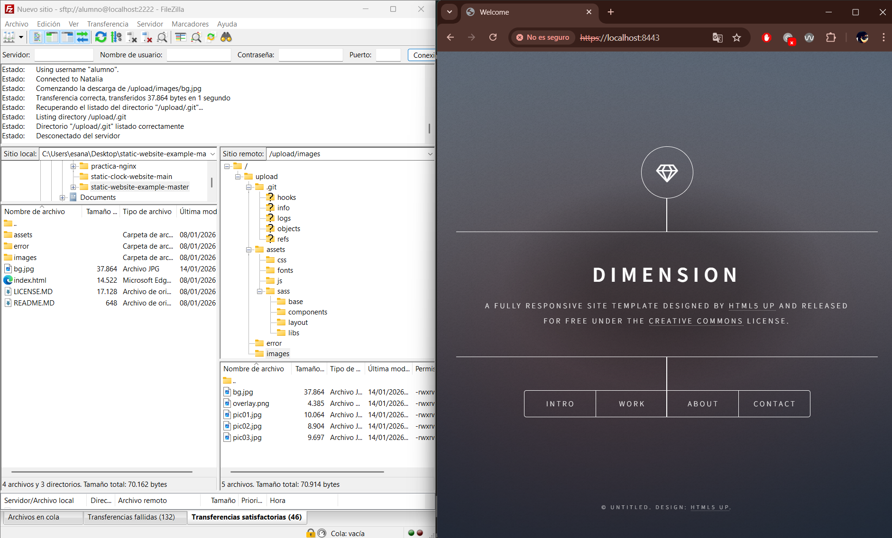

6) Permisos de escritura
- Que demuestra: Que el usuario SFTP puede subir archivos a la carpeta remota y que las transferencias finalizan correctamente.
- Evidencia:
  
  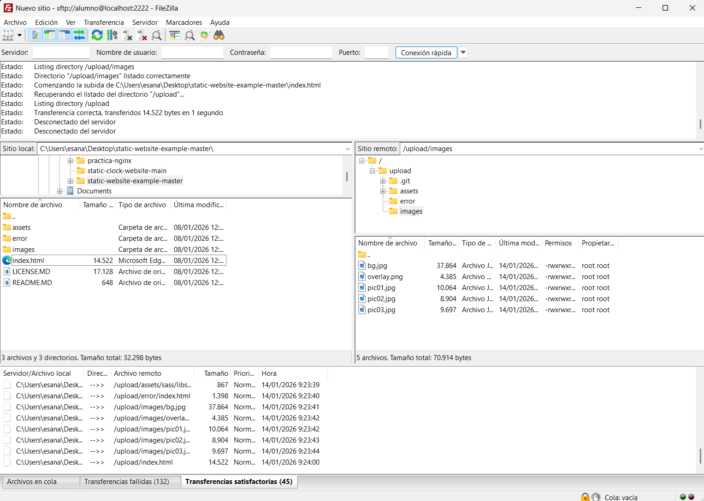

---

### Fase 3: Infraestructura Docker

7) Contenedores activos
- Que demuestra: Que los contenedores de Nginx y SFTP están levantados simultáneamente y exponiendo los puertos configurados.
- Comando: `docker compose ps`
- Evidencia: 
  
  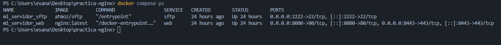

8) Persistencia (Volumen compartido)
- Que demuestra: Que Nginx y SFTP comparten el mismo volumen, de forma que los ficheros subidos por SFTP se sirven en la web.
- Evidencia: 
  
  

9) Despliegue multi-sitio
- Que demuestra: Que la segunda web (reloj) está desplegada en la subruta `/reloj` y que Nginx la sirve correctamente desde `/usr/share/nginx/html/reloj`, aunque desde el host se produce un error de conexion (`ERR_CONNECTION_REFUSED`) ajeno a la configuración del servidor.
- Evidencia:   
  - 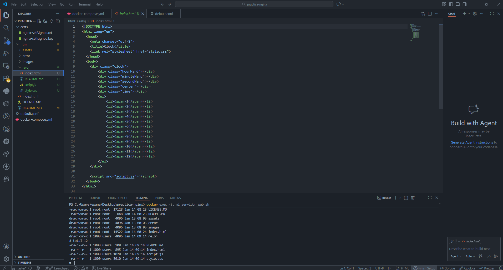  
  -   
  - 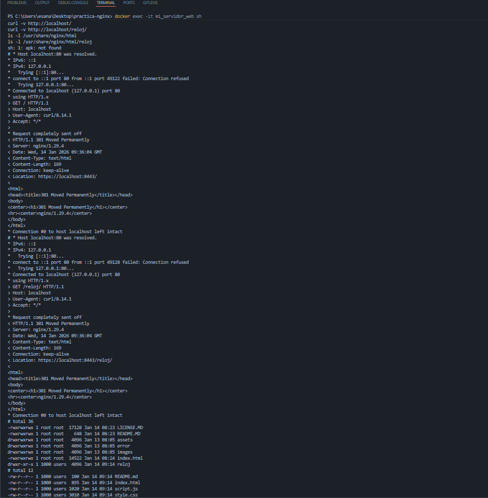  
  - 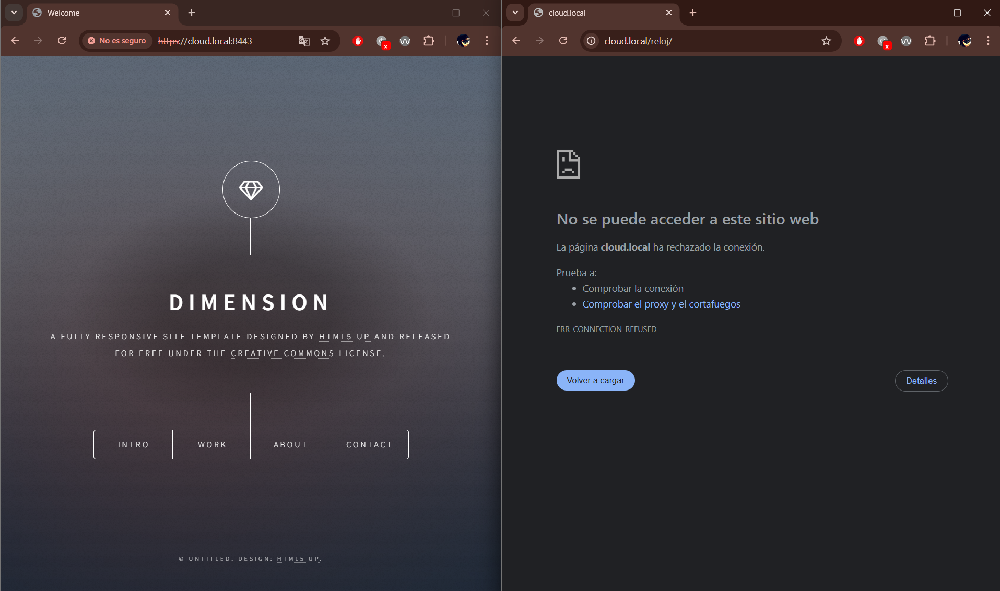

---

### Fase 4: Seguridad HTTPS

10) Cifrado SSL
- Que demuestra: Que el servidor Nginx sirve contenido por HTTPS utilizando un certificado digital autofirmado almacenado en la carpeta `certs`.
- Evidencia:  

  - 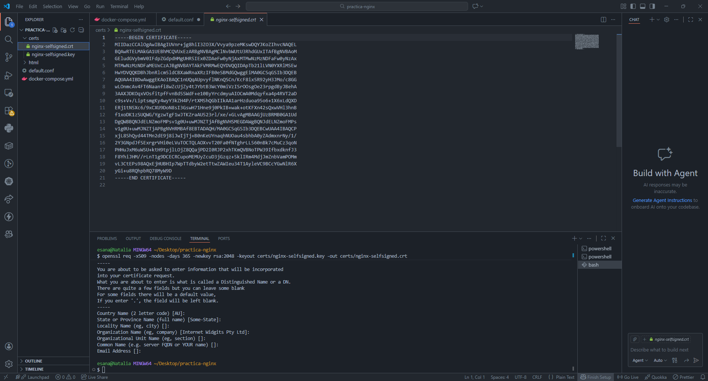

11) Redireccion forzada
- Que demuestra: Que las peticiones HTTP al puerto 8080 se redirigen automaticamente a HTTPS en el puerto 8443 con codigo 301.
- Evidencia: 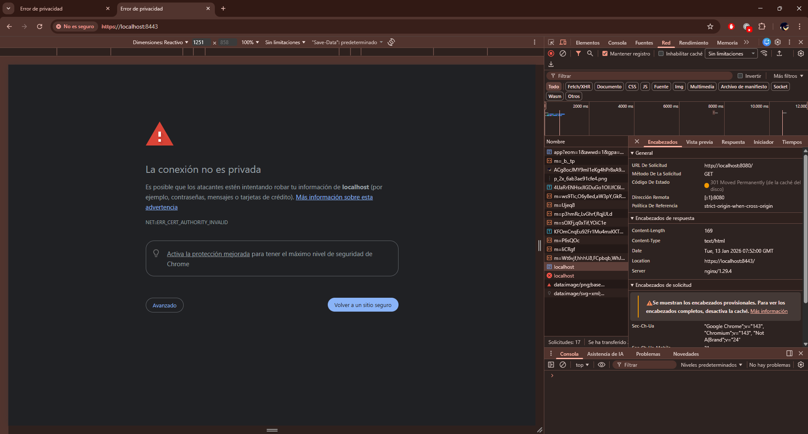

---

## Parte 2 — Evaluacion RA2 (a–j)

### a) Parametros de administracion
- Respuesta:
- Evidencias:
  - evidencias/a-01-grep-nginxconf.png
  - evidencias/a-02-nginx-t.png
  - evidencias/a-03-reload.png

### b) Ampliacion de funcionalidad + modulo investigado
- Opcion elegida (B1 o B2):
- Respuesta:
- Evidencias (B1 o B2):
  - evidencias/b1-01-gzipconf.png
  - evidencias/b1-02-compose-volume-gzip.png
  - evidencias/b1-03-nginx-t.png
  - evidencias/b1-04-curl-gzip.png
  - evidencias/b2-01-defaultconf-headers.png
  - evidencias/b2-02-nginx-t.png
  - evidencias/b2-03-curl-https-headers.png

#### Modulo investigado: <NOMBRE>
- Para que sirve:
- Como se instala/carga:
- Fuente(s):

### c) Sitios virtuales / multi-sitio
- Respuesta:
- Evidencias:
  - evidencias/c-01-root.png
  - evidencias/c-02-reloj.png
  - evidencias/c-03-defaultconf-inside.png

### d) Autenticacion y control de acceso
- Respuesta:
- Evidencias:
  - evidencias/d-01-admin-html.png
  - evidencias/d-02-defaultconf-auth.png
  - evidencias/d-03-curl-401.png
  - evidencias/d-04-curl-200.png

### e) Certificados digitales
- Respuesta:
- Evidencias:
  - evidencias/e-01-ls-certs.png
  - evidencias/e-02-compose-certs.png
  - evidencias/e-03-defaultconf-ssl.png

### f) Comunicaciones seguras
- Respuesta:
- Evidencias:
  - evidencias/f-01-https.png
  - evidencias/f-02-301-network.png

### g) Documentacion
- Respuesta:
- Evidencias: enlaces a todas las capturas

### h) Ajustes para implantacion de apps
- Respuesta:
- Evidencias:
  - evidencias/h-01-root.png
  - evidencias/h-02-reloj.png

### i) Virtualizacion en despliegue
- Respuesta:
- Evidencias:
  - evidencias/i-01-compose-ps.png

### j) Logs: monitorizacion y analisis
- Respuesta:
- Evidencias:
  - evidencias/j-01-logs-follow.png
  - evidencias/j-02-metricas.png

---

## Checklist final

### Parte 1
- [ ] 1) Servicio Nginx activo
- [ ] 2) Configuracion cargada
- [ ] 3) Resolucion de nombres
- [ ] 4) Contenido Web (Cloud Academy)
- [ ] 5) Conexion SFTP exitosa
- [ ] 6) Permisos de escritura
- [ ] 7) Contenedores activos
- [ ] 8) Persistencia (Volumen compartido)
- [ ] 9) Despliegue multi-sitio (/reloj)
- [ ] 10) Cifrado SSL
- [ ] 11) Redireccion forzada (301)

### Parte 2 (RA2)
- [ ] a) Parametros de administracion
- [ ] b) Ampliacion de funcionalidad + modulo investigado
- [ ] c) Sitios virtuales / multi-sitio
- [ ] d) Autenticacion y control de acceso
- [ ] e) Certificados digitales
- [ ] f) Comunicaciones seguras
- [ ] g) Documentacion
- [ ] h) Ajustes para implantacion de apps
- [ ] i) Virtualizacion en despliegue
- [ ] j) Logs: monitorizacion y analisis
